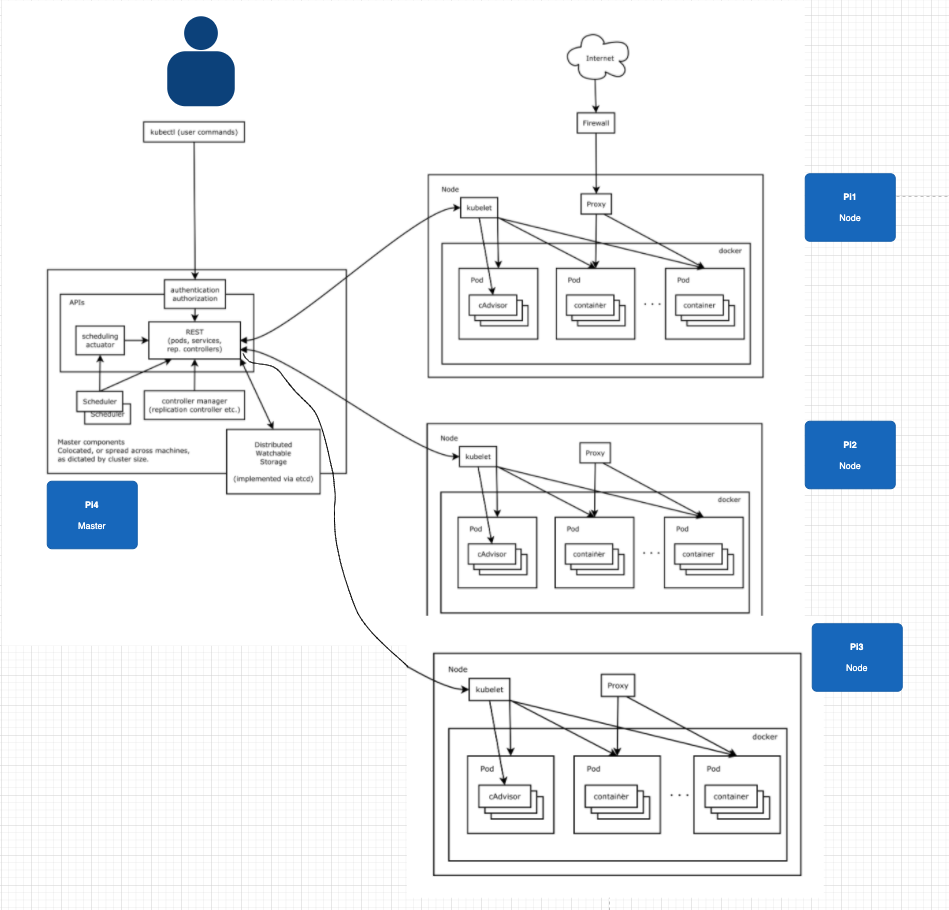

# Install k8s on raspberry pi
Use the 4 pis as server
* node is [raspberry pi 3B](https://www.raspberrypi.org/products/raspberry-pi-3-model-b-plus/) + 64GB SD
  * pi1
  * pi2
  * pi3
* master is （raspberry pi 4B 4GB)[https://www.raspberrypi.org/products/raspberry-pi-4-model-b/] + 64GB SD
  * pi4

## Server provisioning
* Raspberry Buster is support version 
* use the ali cloud source mirror as apt, docker image and Kubernetes
* install docker as container runtime
* install python3 and pip3 as the default python runtime
* install the full vim instead of vim common
* install kubeadm, etcd, kubelet and so on of the kubernate components

## Architecture

## How to use
* This repo is composed of Ansible, Bash
* The python version is 3.7.7
* Please install [pipenv](https://github.com/pypa/pipenv)
* Setup the repo by pipenv install
* Setup the command line by pipenv run **ansbile commad**

## Others
* System setup, 
  which is about Raspberry pi server OS, hostname, ssh and so on, is on the [raspberry-os-self-setting-image](https://github.com/victoryw/raspberry-os-self-setting-image).
  This repo will resolve the problem of how automate burn os, and setup the hostname, ssh and so on.
* Todo:
  * complete the k8s docker image retag
  * use the tag, hosts to split the playbook
  * keep the provision idempotent, especially the k8s master, worker setup
  * the master and worker nodes should work parallel and relevancy
  * use the kubeadm token in the master create to register to run in the worker
  * setup the k8s network by version
  * the system setup, such as cgroup, 
  * to solve unable to resolve host pi4: Name or service not known
  * upgrade the master to cluster
  
